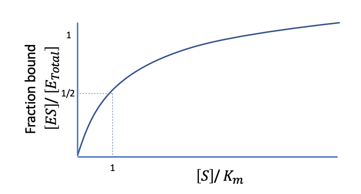

# Transcription Networks

Genes are controlled by transcriptions factors which excite or inhibit transcription within a gene. 

Transcription factors are made of proteins, thus, genes create a network of signals which can respond to stimuli such as glucose requirements and DNA repair, maintaining the balance of a cell

The set of interactions between genes is known as a transcription network, which are responsible for the fine grained control of a cell. Nodes are genes and arcs represent transcription regulation factors

Transcription networks tell us:
- The genes involved in regulation
- The environmental signals (input)
- The dynamic system present in the cell
- The production rate of proteins

We need to understand how rates and concentrations of molecules change to understand the kinetics of enzyme reactions, e.g. transcription factors

Transcription factors fall under two categories:
- Repressors: binds to promoter region to turn off gene by preventing production of mRNA
- Activator: Binds to promoter region to promote production of mRNA
Both of these can bind at the same time

These two factors control the transcription rate of a gene. Arcs are indicated with + (Activator) and - (Repressor) and a number to indicate their input function (e.g. the hill coefficient)

With some understanding of the transcription parameters it is possible to simulate the dynamic processes represented in transcription networks, important for understanding how cells respond to environmental factors. 

In reality cell molecules are present in very low concentrations and randomness makes creating a function system problematic

Randomness comes from:
- Extrinsic noise (variations in reaction): difference in number of RNA polymerase, number of ribosomes, size of cell
- Intrinsic noise (inherent randomness)

### Chemistry

The concentration of chemicals is given as moles 

The rate of a reaction for equation: \\( X + 2Y \overset{\rightarrow}{k} Z \\) is given as \\( \frac{d[Z]}{dt} = k[X][Y]^2 \\) 

The Michalis Menton kinetics is a simple form of enzyme kinetics, in which enzymes and substrates react to create enzymes and a product. The Michalis Menton equation describes the rate of product formulation based on certain assumptions. 

To derive the Michalis Menton equation we start with the equation: \\[ E + S \underset{k_{-1}}{\overset{k_{1}}{\rightleftarrows}} ES \underset{k_{-2}}{\overset{k_{2}}{\rightleftarrows}} E + P \\]
Where:
- E: Enzyme concentration
- S: Substrate concentration
- P: Product concentration
- k: rate of reactions

With the following assumptions:
- The binding step is fast and E+S to ES starts as equilibrium. This means the product formulation \\( k_2 \\) is rate limiting
- We assume the product starts at zero/little concentration, thus, \\( k_{-2} \\) can be ignored. The initial rate of product \\( V_0 = k_2[ES] \\)
- \\( E_{total} \\) can be given as E + ES
- The previous assumption is true when S is much larger than E total as the fraction that binds to the enzyme is negligible, meaning S is nearly constant.

From the assumptions we get the Rate of formulation equal to the Rate of breakdown, in addition to k-2 == 0. We can write: \\[ [E][S] = [ES]K_m;\ K_m = \frac{k_{-1} + k_2}{k_1} \\]

Where \\( K_m \\) is known as the Michaelis Constant

By substituting \\( [E] \\) for \\( [E_{total}] - [ES] \\) and rearranging we get: \\[ \frac{[E_{total}][S]}{K_m + [S]} = [ES] \\]

By plugging into the initial velocity from assumption 2, and assuming that all enzyme will be bound given sufficient substrate (i.e. \\(V_{max} = k_2[E_{total}] \\)) we get the Michaelis Menton Equation:

\\[ V_0 = \frac{V_{max}[S]}{K_m + [S]} \\]

From the plot we can see:
- Pseudo-linear when substrate concentration is low
- Reaches saturation at high substrate
- Is half maximal when substrate equals constant

So far MM has assumed there is no repressor or activator

We can use the Hill Function to model the presence of repressors and activators. Which consists of:
- \\( K \\): the activation coefficient, i.e. the concentration of X required to repress expression
- \\( $\beta$ \\): the maximal production rate 
- \\( n \\): the hill coefficient

The **Repressor Hill function** is given: \\[ f(X) = \beta \frac{K^n}{K^n + X^n} \\]

The **Activator Hill function** is given: \\[ f(X) = \beta \frac{X^n}{K^n + X^n} \\]

Where n=1 we have MM dynamics

To model the promotor activity, where:
- D = promoter
- X = repressor
- Kd = off/on

\\[ X + D \underset{k_{on}}{\overset{k_{off}}{\rightleftarrows}} XD \\]

The total concentration of the promoter is given: \\( [D_T] = [D] + [XD] \\)

At equilibrium (\\( \frac{d[XD]}{dt} = 0 \\)) we get \\( \frac{D}{D_T} = \frac{1}{1 + [X]/K_d} \\) which can give us the promotor activity when multiplied by \\( \beta \\)

By adding a repressor protein we get \\( X_T = [X] + [XS_X] \\), At equilibrium we get \\[ \frac{[X_T][S_X]}{K_X + [S]} = [XS_X] \\] i.e. the MM equation

However, must transcription factors are comprised of repeated sub units, giving us: \\[\frac{[nXS_X]}{[X_T]} = \frac{[S_X]^n}{K^n_X + [S_X]^n} \\] at equilibrium i.e. the hill equation

In reality both the repressor and activator can bind to the gene at different points within the promotor. Therefore, we need a multidimensional input of both the activator and repressor concentrations

